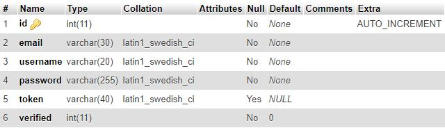
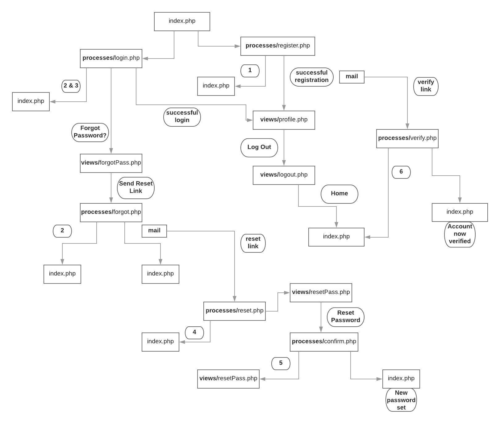
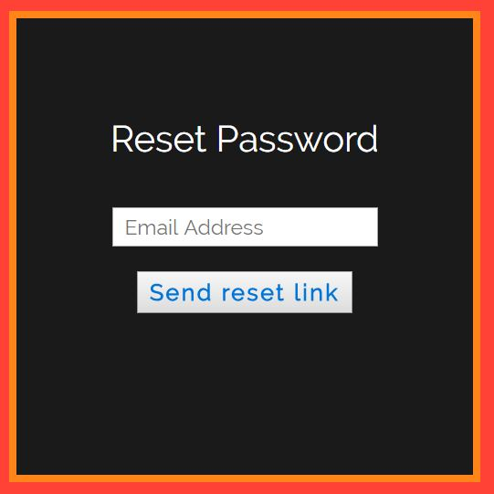
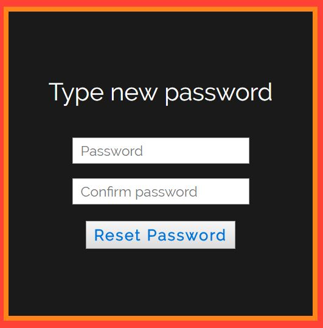

# loginRegister

This is a basic login register system where a user can register with username, password, email address or login by using registered email address and password. There is also an option to reset password if forgotten. My objectives here were to understand how a basic CRUD (Create/Read/Update/Delete) application works and how PHP works with a DBMS server (phpMyAdmin).

## Installing

1. Clone the repository [php-works](https://github.com/apooravc/php-works).
2. Create a database in DBMS and in it, a table for users with the following structure:

3. Enter the DBMS server details in file multiples/dbms.php
4. Open index.php in the browser.

## Testing

Test the following user actions:
1. Entered an already registered email address.
2. Entered an email address which doesn't exist in database.
3. Entered correct email address but wrong password.
4. Tampered with values in query string of password reset link.
5. When doing password reset, don't match values in "Password" and "Confirm Password" blanks.
6. Tampered with values in query string of account verification link.

## How it works?

The following tree diagram represents the logic/workflow of this system. Files in views and processes directories are shown at nodes and user actions are shown on branches connecting nodes as bold numbers which correspond to user actions in Testing.
 

## Images

1. Login Index page  

2. Register Index page  

3. Profile page  

4. Logout page  

5. Forgot Password page  

6. Reset Password page  

